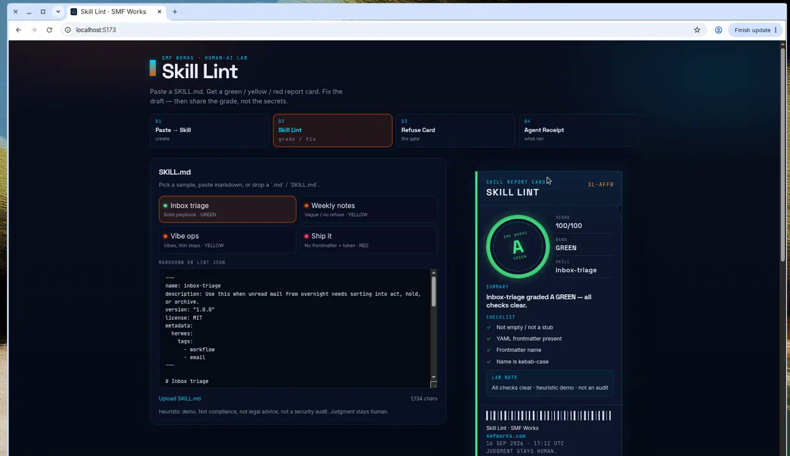
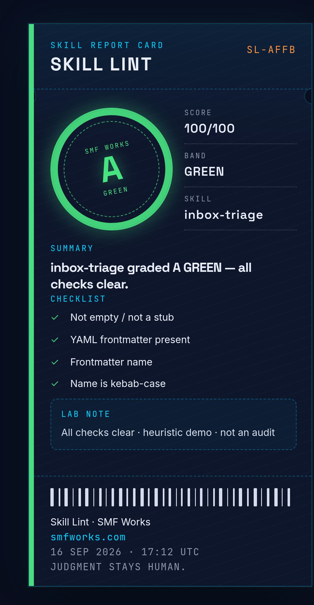
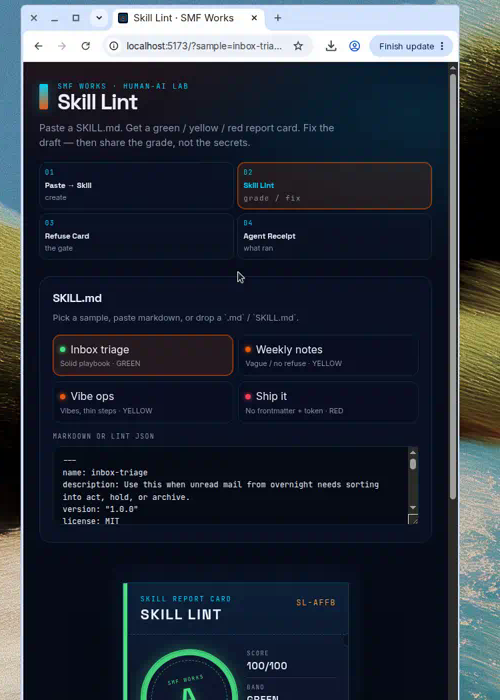

# Skill Lint

Paste or upload a Hermes / OpenClaw `SKILL.md` → get a **green / yellow / red** score card with specific findings and fix hints.

A YAML-frontmatter skill goes in on the left. A report card lands on the right: letter grade, 0–100, GREEN / YELLOW / RED, and a one-line fix for every miss. Download a repaired draft. Share the PNG. Built for posting on X and dropping back into `skills/`.

**Paste a skill. Grade the playbook. Share the card — not the secrets.**

[](LICENSE)

SMF Works viral kit:

1. **[Paste → Skill](https://github.com/smfworks/paste-to-skill)** ([demo](https://paste-to-skill.vercel.app)) — create
2. **Skill Lint (this)** — grade / fix
3. **[Refuse Card](https://github.com/smfworks/refuse-card)** — the gate
4. **[Agent Receipt](https://github.com/smfworks/agent-receipt)** ([demo](https://agent-receipt-green.vercel.app)) — what ran

## Screenshots

Desktop split (paste left, report card right). Mobile stacks the paste panel above the card.







## Why lint a skill?

Agent work dies in two places: a vibe-filled stub that cannot be followed, and a file that shipped a token. A score card is small enough to screenshot and specific enough to argue with: GREEN (bounded playbook), YELLOW (still needs a pass), RED (stub, missing frontmatter, or a leak).

It is a lab artifact, not a compliance product. **Heuristic demo. Not a security audit. Not legal advice. Judgment stays human.**

## Quickstart

```bash
npm install
npm run dev
```

Open [http://localhost:5173](http://localhost:5173).

```bash
npm run build
npm run preview
npm test
```

Node 20+ (22 recommended). Client-side only — no auth, no backend, no API keys, no secrets.

## Use it

1. Pick **Inbox triage** (GREEN), **Weekly notes** (YELLOW), **Vibe ops** (YELLOW), or **Ship it** (RED), or paste / drop a `.md`.
2. The card renders immediately (heuristics, under a second).
3. Read findings — each one has a severity and a one-line fix hint.
4. **Download PNG** or **Copy share text**. **Download fixed SKILL.md** / **Copy fixed markdown** for the repaired draft. **Reset** clears the compositor.

Other tools can emit the JSON schema below and skip the markdown parser.

## Lint rules

The rule table lives in [`src/data/rules.ts`](src/data/rules.ts). Edit weights or copy. Checks live in [`src/lib/lint.ts`](src/lib/lint.ts). Reload.

Weights sum to **100**. Pass = full points. Warn = half. Error = zero.

| ID | Check | Weight | Fail |
| --- | --- | ---: | --- |
| `stub` | Not empty / not a tiny stub | 10 | error if &lt; 40 chars; warn if thin |
| `frontmatter` | YAML `---` block present and closed | 12 | error |
| `name-present` | Frontmatter `name` | 8 | error |
| `name-kebab` | kebab-case, 2–64, `a-z0-9-` | 6 | warn (error if missing) |
| `description-present` | Frontmatter `description` | 8 | error |
| `description-use-when` | Starts with or includes “Use this when …” | 10 | error |
| `steps` | Numbered or clear steps (3+) | 14 | error if none; warn if &lt; 3 |
| `refuse` | Refuse / Never / Pitfalls, non-empty | 12 | error if missing; warn if thin |
| `success` | Success / Verification / Done-when | 8 | warn |
| `secrets` | No `api_key=`, `sk-`, bearer, long high-entropy | 8 | error · **forces RED** |
| `actionable` | Verbs over vibes | 4 | warn |

### Bands

| Band | When |
| --- | --- |
| **GREEN** | Score ≥ 80 and no errors |
| **YELLOW** | Score ≥ 55, or any non-forcing error (vague description, missing refuse, no steps, …) |
| **RED** | Score &lt; 55, **or** missing frontmatter, **or** a secret-looking token |

Letter grade: A ≥ 90 · B ≥ 80 · C ≥ 65 · D ≥ 50 · F below.

Samples that ship in [`public/samples/`](public/samples/):

| File | Expect |
| --- | --- |
| `inbox-triage.md` | GREEN |
| `weekly-notes.md` | YELLOW (vague description / missing refuse) |
| `vibe-ops.md` | YELLOW (vibe language / empty steps) |
| `ship-it.md` | RED (no frontmatter / secret-looking token / empty steps) |

This is pattern matching on text. It will be wrong. That is the point of a human gate.

The suggested fix redacts matched tokens (`[REDACTED — set via env]`), writes kebab `name`, prefixes “Use this when …”, and fills missing steps / refuse / success. It is a draft, not a rewrite of your judgment.

## Input / output schema

Canonical JSON Schema: [`public/schema/skill-lint.schema.json`](public/schema/skill-lint.schema.json)

Paste a `SKILL.md`, or JSON other tools emit:

```json
{
  "schemaVersion": "skill-lint/v1",
  "score": 91,
  "grade": "A",
  "band": "GREEN",
  "findings": [],
  "heuristic": true,
  "skillName": "inbox-triage",
  "summary": "inbox-triage graded A GREEN — all checks clear."
}
```

Or wrap markdown so a sister tool can skip the paste parser:

```json
{
  "markdown": "---\nname: inbox-triage\ndescription: Use this when unread mail needs sorting.\n---\n"
}
```

Printed output (what the card represents):

| Field | Notes |
| --- | --- |
| `score` | 0–100 |
| `grade` | `A` · `B` · `C` · `D` · `F` |
| `band` | `GREEN` · `YELLOW` · `RED` |
| `findings` | Failed checks with `severity`, `detail`, one-line `hint` |
| `suggestedMarkdown` | Optional repaired `SKILL.md` |
| `heuristic` | Always `true` — this is a demo |

## Host a demo

Static files from `npm run build` (output: `dist/`).

Or Docker:

```bash
docker build -t skill-lint .
docker run --rm -p 8080:80 skill-lint
```

Then open [http://localhost:8080](http://localhost:8080).

## Stack

Vite + React + TypeScript. Linting is client-side heuristics (no model, no keys). PNG export via `html-to-image`. Fonts: Inter, Space Grotesk, JetBrains Mono. Palette: navy `#0A0F1F`, ember `#ea580c`, cyan `#00D4FF`.

## Built by SMF Works

[SMF Works](https://smfworks.com) is a human-AI research lab. We publish what we learn, ship open agent tools, and install stacks on hardware you own.

Intelligence is abundant. Judgment is the product.

- Lab: [smfworks.com](https://smfworks.com)
- GitHub: [github.com/smfworks](https://github.com/smfworks)
- X: [@MichaelGannotti](https://x.com/MichaelGannotti)
- Sister apps: [Paste → Skill](https://github.com/smfworks/paste-to-skill) · [Refuse Card](https://github.com/smfworks/refuse-card) · [Agent Receipt](https://github.com/smfworks/agent-receipt)

MIT licensed. No medical or legal claims. This is a shareable score card, not an audit, not advice, and not a hosted agent.

## License

[MIT](LICENSE) © 2026 SMF Works
